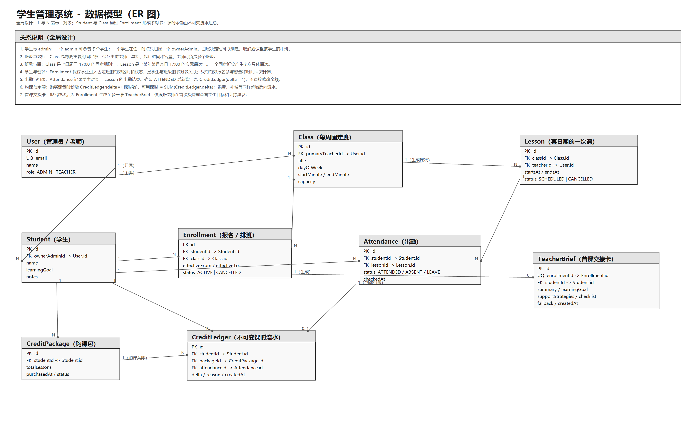

# 学生管理系统 - 设计文档

## 1. 我对业务的理解

这是一个帮助教育机构把学生的学习安排、可售课时、每周固定班和授课老师协调起来的运营系统。
除了Excel 和微信群的问题，后续还需要解决：当学生数量和固定班级变多后，谁负责、什么时候上课、是否还有课时、老师课前需要知道什么，不能继续依赖人工记忆和聊天记录等。

### 角色有四类：

1. admin（课程顾问 / 教务）：负责学生关系和学习安排。他们关心自己名下有哪些学生、谁存在课时或排班风险、能否把学生安排进合适的固定班级，以及课时售前/售后问题。
2. 老师：负责实际授课。他们关心今天有哪些课、每节课有哪些学生、哪些是刚加入的新学生、学生的学习目标和部分特殊学生需要注意的事项。
3. 学生与家长：虽然不直接使用后台，但系统最终服务于他们。他们关心课程内容和老师是否适合学生的年龄、基础与学习目标；学习安排是否合理可持续；已购课时是否被正确使用；以及遇到变化时是否有人负责跟进。
4. 运营管理员：第一版不直接覆盖这个角色，但后续会关注班级容量、老师负载、学生归属、续费风险和整体运营效率。

### 核心流程

咨询 -> 试听 -> 报名购课 -> 固定班排班 -> 出勤扣课 -> 续费或流失。

## 2. 第一版解决与不解决的问题

### 第一版先解决：

admin 对学生状态和关键风险缺乏统一视图的问题。 优先解决admin 可以查看学生当前固定班和可用课时等信息和当前所处阶段，例如咨询中、已安排试听、试听待跟进、已报名、已进入固定班、课时不足或已流失；并能快速定位需要处理的学生，例如试听结束后尚未跟进、固定班时间冲突、班级容量不足、课时余额不足。 admin 为本人负责的已报名学生安排固定班，提交后系统由服务端返回明确的成功或失败原因；排班成功后生成老师可读的首课交接卡。老师登录后只能查看自己负责的班与必要的学生学习摘要(可用课时，历史上课时间，是否新生等)。

#### 原因是：上述问题直接影响教育机构每天的运营质量，也最容易造成学生体验和收入损失。

### 认为重要但这次故意不做：

1. 咨询线索、试听预约、报名付款、合同与退款；这些需要独立的销售和财务规则，不能直接在系统中处理。
2. 请假、补课、调班、停课、教师代课和转 admin；这些都会影响固定班的有效区间与课时流水，应在下一阶段先确认规则再实现。
3. 出勤录入和自动扣课
4. 续费提醒与流失运营
5. 家长咨询AI问答系统

。。。

## 3. 数据模型：

## 4. 关键规则：


| 规则 | 执行层 | 
| --- | --- | 
| 只有学生的 `ownerAdminId` 对应的 admin 能创建/取消/修改其排班 | NestJS 鉴权守卫 + 排班服务 | 
| 学生可用课时必须至少为 1，排班不预扣 | 排班服务  |
| 同一学生两个有效固定班在同一星期且区间重叠时拒绝 | 排班服务 | 
| 班级有效报名人数不能超过容量。 | NestJS 服务层事务  | 
| 排班不会立即扣减课时；只有老师确认某次课程实际到课后，系统才新增一条负数课时流水。 | 服务层  |
| 老师只能查看本人负责班级的课程、学生名单和必要教学摘要。 | API 鉴权 + 查询条件 | 
| 学生从咨询、试听、报名、入班到流失的状态变化必须符合预定义状态流转。 | NestJS 服务层 | 


## 5. 假设和问题：
### 假设：
1. 一个学生当前只归属一位主 admin；
2. 报名时只检查余额，真正扣课发生在未来的到课登记；
3. 一名学生可同时加入多个不重叠班；
4. 所有班级的容量都是固定的，不能超过最大人数。
5. 老师 可以看教学必要的学生目标和注意事项，但看不到其他 admin 的客户。

希望业务方确认：

1. “已报名”在业务上具体以什么为准？是完成付款、签署合同，还是 admin 手工确认后即可进入固定班？如果退款或付款失败，已有固定班报名应如何处理？
2. 课包是否有有效期、冻结、退款或跨课程类型使用限制？

3. 一个班是否允许助教、临时加座或按年龄/水平设置额外准入条件？

4. 课时在什么情况下真正扣减？老师录入“到课”后立即生成一条不可修改的负数流水吗；请假、迟到、缺课、补课、教师取消课程分别扣不扣课、如何留下可追溯记录？

5. 学生转给另一位 admin、换班或教师临时请假时，谁有权限操作？已经排好的固定班、课时记录和教师首课交接卡应继续沿用、失效，还是需要重新生成？


## 6. 页面与信息结构
| 页面 | 使用者 | 页面目标 | 首屏重点信息 | 主要操作 |
| --- | --- | --- | --- | --- |
| 登录页 | Admin、Teacher、学生/家长 | 确认身份并进入对应工作台 | 账号输入、密码输入、登录错误提示 | 登录、找回密码、首次登录指引 |
| Admin 风险首页 | Admin | 快速发现和处理需要推进的学生 | 待跟进试听、课时不足、固定班冲突、满班风险、本人负责学生、今日待办 | 搜索学生、进入风险学生详情、记录跟进、发起排班 |
| 学生列表 | Admin | 按条件定位学生并管理学生池 | 学生姓名、当前阶段、负责人、固定班、课时余额、最近跟进时间、风险标签 | 搜索、筛选、排序、进入学生详情 |
| 学生详情页 | Admin；授权 Teacher 仅查看必要摘要 | 集中查看一名学生的状态和完整历史 | 当前阶段、归属 admin、学习目标、固定班、课时余额、下一步建议 | 编辑学生资料、安排固定班、查看课时流水、记录跟进、查看学习记录 |
| 排班检查侧栏 / 页面 | Admin | 为学生安排固定班，并在提交前检查业务规则 | 当前固定班、可用课时、可选班级、老师、上课时间、班级容量、检查结果 | 选择班级、选择生效日期、提交排班、取消排班、查看失败原因 |
| 班级列表 | Admin、Teacher | 查找固定班并了解班级资源使用情况 | 班级名称、授课老师、每周时间、容量、已报名人数、状态 | 搜索班级、按课程/老师/时间筛选、进入班级详情 |
| 班级详情页 | Admin、该班 Teacher | 管理一个固定班及其学生名单和未来课次 | 固定班规则、老师、容量、有效报名学生、未来课次、候补名单 | 查看学生、添加或取消报名、查看课次、调整班级信息、查看交接卡 |
| 今日课次页 | Teacher | 让老师快速完成当天授课准备 | 今日课次、时间、班级、学生人数、新生提醒、低余额提醒 | 进入课堂详情、查看学生摘要、查看首课交接卡、登记出勤 |
| 课次详情 / 出勤页 | 该课 Teacher；Admin 可查看 | 管理某个日期的一次具体课程 | 实际上课时间、授课老师、学生名单、出勤状态、请假状态、课堂备注 | 标记到课/缺勤/请假、保存课堂备注、查看学生摘要、触发课时扣减 |
| 课时与购课包页 | Admin；学生/家长可查看本人数据 | 查看课时来源、消耗和余额 | 当前可用课时、购课包、课时流水、关联课次、调整原因 | 创建购课包、查看流水、发起退款或补偿、查看扣课依据 |
| 试听与跟进中心 | Admin | 管理从咨询到报名的学生转化过程 | 咨询中、已安排试听、试听待跟进、已报名、已流失学生数量和名单 | 创建跟进任务、记录沟通、安排试听、标记报名、记录流失原因 |
| 家长首页 | 学生/家长 | 了解课程、课时和最新通知 | 下一节课、当前固定班、可用课时、请假状态、老师反馈、待处理事项 | 查看课程表、查看课时、提交请假、发起咨询、查看学习反馈 |
| 课程表页 | Admin、Teacher、学生/家长 | 以时间维度查看固定班和具体课次 | 周视图/月视图、课程时间、老师、班级、状态、冲突提示 | 切换日期、查看课次、申请请假、查看班级详情 |
| 教师与班级资源页 | Admin | 查看教师负载和班级资源是否合理 | 教师课表、负责班级数、学生数、可授课时间、代课安排 | 分配老师、查看负载、安排代课、调整班级老师 |
| 运营报表页 | Admin | 观察报名、班级、课时和风险处理情况 | 转化漏斗、班级利用率、教师负载、课时消耗、风险处理时效 | 筛选时间范围、按课程查看、下钻学生或班级明细 |
| 系统设置页 | Admin | 维护基础数据和业务规则配置 | 课程分类、教室、校区、课时规则、通知模板 | 配置课程、维护教师、维护教室、设置规则参数 |


### 1. Admin 风险首页
```
+--------------------------------------------------------------------------------+
| 学生管理系统                                      [搜索学生] [通知] [Admin 头像] |
+-------------------+------------------------------------------------------------+
| 我的工作台         | 今日需要处理                                               |
| - 风险首页         |                                                            |
| - 我的学生         | [试听待跟进 12] [课时不足 8] [时间冲突 3] [满班风险 4]     |
| - 班级与课次       |                                                            |
| - 课时与订单       | 优先处理                                                   |
| - 试听与跟进       | +--------------------------------------------------------+ |
| - 报表             | | 学生       当前阶段       风险              下一步    | |
|                   | | 小林       试听待跟进     已试听 2 天未联系  [跟进] | |
|                   | | Emma      已报名          固定班时间冲突    [排班] | |
|                   | | Noah      已进入固定班    仅剩 1 节课时     [查看] | |
|                   | +--------------------------------------------------------+ |
|                   |                                                            |
|                   | 我的学生                                                     |
|                   | [按阶段筛选] [按负责人筛选] [按课程筛选] [按风险筛选]       |
|                   | 学生列表：姓名 | 当前班级 | 余额 | 当前阶段 | 最近动作      |
+-------------------+------------------------------------------------------------+

```

### 2. 学生详情页
```
+--------------------------------------------------------------------------------+
| < 返回风险首页     学生：小林（新生）                     [编辑资料] [更多操作] |
+--------------------------------------------------------------------------------+
| 当前阶段：已报名 -> 待安排固定班       负责人：Ava Admin      家长：王女士       |
| 学习目标：提升节奏感与舞台自信          可用课时：3 节          最近联系：昨天    |
+--------------------------------------------------------------------------------+
| [概览] [固定班与课次] [课时流水] [试听与跟进] [学习记录] [沟通记录]             |
+-----------------------------------------+--------------------------------------+
| 当前固定班                              | 下一步建议                           |
| - 周三 17:00 Jazz 基础班                | - 当前无固定班                       |
| - 授课老师：Luca                        | - 推荐安排周三 Jazz 基础班            |
| - 当前状态：未安排                      | - 排班前检查余额与时间冲突            |
|                                         |                                      |
| [安排固定班]                            | [查看可选班级]                        |
+-----------------------------------------+--------------------------------------+
| 关键时间线                                                                    |
| 09/10  已完成试听：老师建议进入基础班                                           |
| 09/12  Admin 跟进：家长确认报名                                                 |
| 09/15  购买 10 节课包，课时流水 +10                                               |
+--------------------------------------------------------------------------------+
```
### 3. 排班检查侧栏
```
+------------------------------------------------------+
| 为小林安排固定班                                [X]  |
+------------------------------------------------------+
| 当前信息                                             |
| - 当前阶段：已报名                                  |
| - 可用课时：3 节                                     |
| - 已有固定班：无                                     |
| - 学习目标：节奏与协调训练                            |
+------------------------------------------------------+
| 选择固定班                                           |
| ( ) Jazz 基础班    周三 17:00-18:00   Luca   6 / 10 |
| ( ) Contemporary   周三 17:30-18:30   Mia    9 / 10 |
| ( ) Hip-hop 入门   周五 16:00-17:00   Luca   10 /10 |
+------------------------------------------------------+
| 排班检查结果                                         |
| [通过] 学生属于当前 admin                            |
| [通过] 可用课时不少于 1 节                            |
| [通过] 与现有固定班无时间冲突                         |
| [提示] Jazz 基础班尚余 4 个名额                       |
+------------------------------------------------------+
|                         [取消] [确认并生成首课交接卡] |
+------------------------------------------------------+
```
### 4. 老师今日课程页
```
+--------------------------------------------------------------------------------+
| 今日课次 - Luca Teacher                                      [日期] [个人中心] |
+--------------------------------------------------------------------------------+
| 16:00 - 17:00   Hip-hop 入门班       8 / 10 人              [进入课堂]         |
| - 新生：小林（首次课）                                                          |
| - 提醒：2 名学生课时余额低于 2 节                                               |
+--------------------------------------------------------------------------------+
| 17:00 - 18:00   Jazz 基础班         10 / 10 人              [进入课堂]         |
| - 已完成出勤：6 / 10                                                         |
+--------------------------------------------------------------------------------+
| 选中课次：Hip-hop 入门班                                                       |
+-------------------------------+------------------------------------------------+
| 学生名单                       | 小林 - 首课交接卡                              |
| [ ] 小林   新生   3 节课时      | 学习目标：建立节奏感和身体协调                 |
| [ ] Emma   常规学生 8 节课时    | 支持建议：先示范，再拆成小步骤                 |
| [ ] Noah   请假申请中           | 首课检查：确认自信程度、留意动作安全           |
|                                |                                                |
| [保存出勤]                      | [查看学生摘要]                                 |
+-------------------------------+------------------------------------------------+
```
## 7. Part B 的选择理由

选择: 把一个已报名学生排进每周班级，并正确处理时间冲突和课时

理由: 这是系统的核心功能，直接关系到学生的学习安排和固定班级的容量管理。

